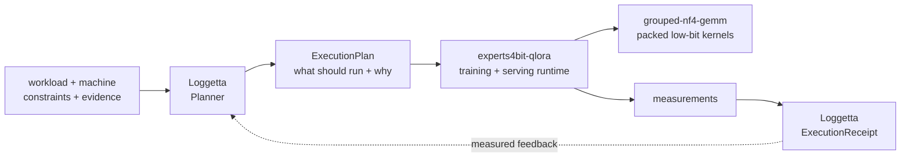

# Jordan Anderson

**ML systems engineer building the planner, runtime, and kernel layers for large models on constrained hardware.**

I tend to find the gap between what a software contract says and what the implementation actually does, then build the missing layer.

Current arc: **large Mixture-of-Experts models on GPUs people actually own**. Make the weights fit, make packed low-bit compute fast, decide what should run before loading it, and keep enough evidence around that every performance claim can be audited later.

> **A 120B MoE QLoRA-trains at 9.82 GB peak VRAM, with 144/144 frozen expert hashes byte-identical after training.**

## The stack

### [`loggetta`](https://github.com/pjordanandrsn/loggetta) 

**Planner + `ExecutionPlan` + `ExecutionReceipt`.** Loggetta turns a workload, a machine, and constraints into an inspectable execution plan before model weights are loaded.

- Chooses among supported configurations under explicit VRAM, RAM, residency, and objective constraints.
- Records the winner, rejected alternatives, refusal reasons, warnings, and evidence quality.
- Delegates execution to the backend rather than reimplementing the runtime.
- Feeds measured receipts back into future planning.
- On an RTX 5090 Qwen3-30B-A3B run, the receipt-calibrated planned process peak was **24.54 GiB vs 24.34 GiB measured**.

Core rule: **Loggetta decides what should execute. The backend knows how to execute it.**

### [`experts4bit-qlora`](https://github.com/pjordanandrsn/experts4bit-qlora) 

**Training and serving runtime for fused MoE experts.** It handles the model-side mechanisms that the planner selects.

- 4-bit quantization of fused expert stacks that bitsandbytes' normal walker silently skips ([bitsandbytes#1849](https://github.com/bitsandbytes-foundation/bitsandbytes/issues/1849)).
- Streaming loading, per-expert LoRA, layer-granular expert offload, training engines, and serving residency.
- **Qwen3-30B-A3B QLoRA: 7.16 GB peak VRAM.**
- **Gemma-4-26B-A4B QLoRA: 8.47 GB peak VRAM.**
- Seed-matched A/B: **57% lower peak VRAM with convergence preserved**, at about +11% seconds/step.
- `enable_fast(model)` routes frozen-expert inference through the packed expert kernel; pipelined residency turns spare VRAM into decode speed.

### [`grouped-nf4-gemm`](https://github.com/pjordanandrsn/grouped-nf4-gemm) 

**Packed low-bit compute and residency primitives.** The grouped expert GEMM operates directly on packed weights, with codebook decode in registers rather than a dequantize-to-bf16 round trip.

- **Qwen3-235B-A22B: 4.3-4.4 tok/s while using 15.2 GB VRAM**, with experts streamed from pinned host RAM at 93-94% of the measured PCIe ceiling.
- Against the identical pipeline with bitsandbytes dequantization: **2.33x throughput and 2.21x energy efficiency**.
- MXFP4 can operate on a checkpoint's released bytes without imposing a requantization tax.
- NVMe extends the residency pyramid from VRAM / host RAM to disk with deterministic, provenance-preserving arena bakes.
- MI300X correctness has been confirmed at the same fidelity tier: **44/44**.

## Receipts-driven engineering

I care as much about the experiment boundary as the winning number.

- Performance claims are tied to the box, software stack, workload, and receipt that produced them.
- Important comparisons are preregistered and [OpenTimestamps-stamped](https://cerinamroth.com/ml/grouped-nf4-gemm/).
- Refuting runs are published alongside successful ones.
- Frozen-weight integrity is checked with hashes rather than assumed.
- Measured, derived, inferred, and heuristic quantities stay distinguishable.

The method is the part I expect to transfer: [**Receipts-driven engineering**](https://cerinamroth.com/ml/grouped-nf4-gemm/).

## Upstream work

Current MoE-stack work includes:

- [bitsandbytes#1965](https://github.com/bitsandbytes-foundation/bitsandbytes/pull/1965) - `Experts4bit` for 4-bit fused MoE experts
- [axolotl#3797](https://github.com/axolotl-ai-cloud/axolotl/pull/3797) - `expert_offload` as a self-contained integration
- [unsloth-zoo#915](https://github.com/unslothai/unsloth-zoo/pull/915) - OLMoE `load_in_4bit` fused-expert routing fix
- [unsloth-zoo#849](https://github.com/unslothai/unsloth-zoo/issues/849) - silent expert-weight transposition, reproduced and fixed upstream

### Intel GPU / OpenVINO

`__local`-pointer kernel-compile fixes across LoRA, MoE, and fully-connected kernels, plus regression coverage:
[#35661](https://github.com/openvinotoolkit/openvino/pull/35661),
[#35712](https://github.com/openvinotoolkit/openvino/pull/35712), and
[#36017](https://github.com/openvinotoolkit/openvino/pull/36017) are merged.
[#36543](https://github.com/openvinotoolkit/openvino/pull/36543) extends the input-validation cleanup.
[`ov-impact-bench`](https://github.com/pjordanandrsn/ov-impact-bench) measures what those fixes unlock on real Intel silicon.

## Elsewhere

Security research on the side, with good-faith testing and coordinated disclosure: [policy](https://cerinamroth.com/policy/).

Research and engineering notes: [cerinamroth.com](https://cerinamroth.com)  
Consulting and broader work: [jordananderson.work](https://jordananderson.work)
