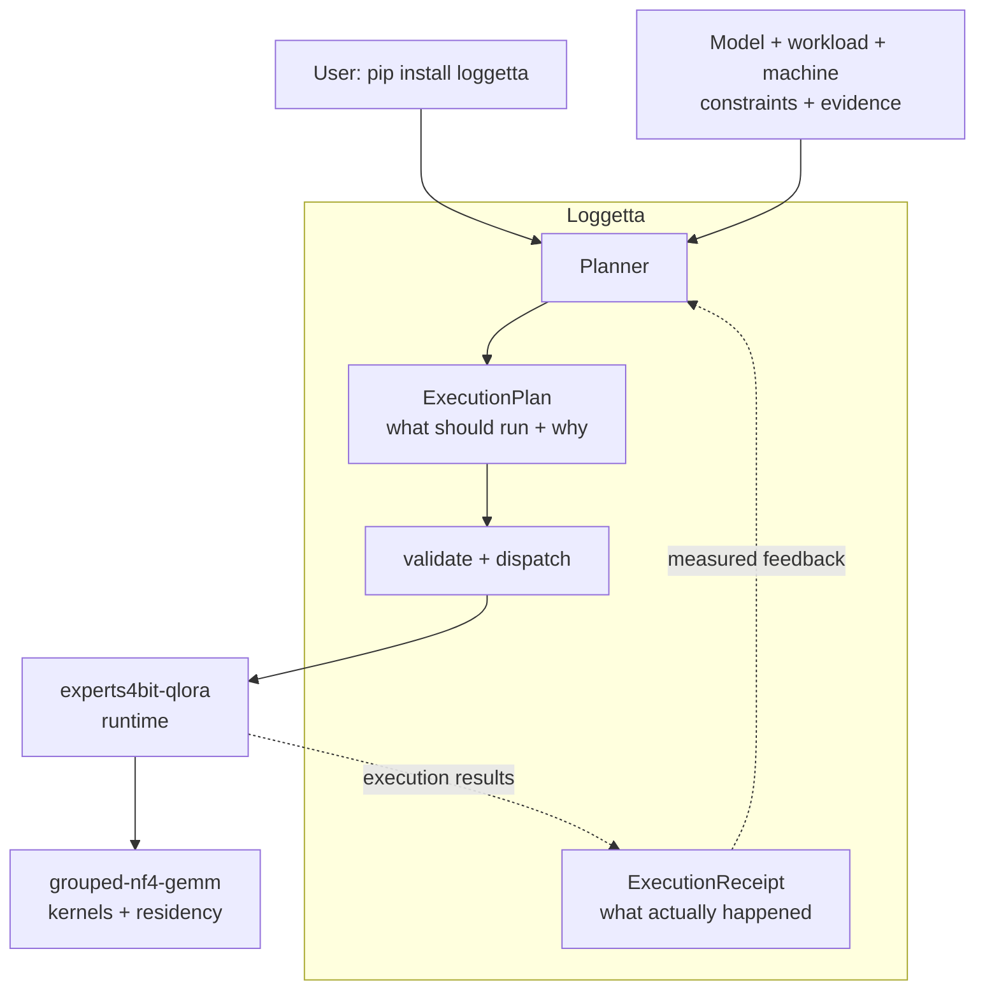

<div align="center">

# Jordan Anderson

### ML systems · low-bit MoE · constrained-GPU execution

**One install. Plan. Run. Measure. Keep the evidence.**

<p>
  <a href="https://github.com/pjordanandrsn/loggetta"></a>
  <a href="https://pypi.org/project/loggetta/"></a>
  <a href="https://pypi.org/project/experts4bit-qlora/"></a>
  <a href="https://pypi.org/project/grouped-nf4-gemm/"></a>
</p>

<p>
  <a href="https://cerinamroth.com">Research notes</a> ·
  <a href="https://jordananderson.work">Work</a> ·
  <a href="https://cerinamroth.com/policy/">Security policy</a>
</p>

</div>

---

I build the missing layer between **“this should fit”** and **“here is what actually ran.”**

My current work is a small systems stack for running and fine-tuning large Mixture-of-Experts models on hardware far smaller than the model.

## Start with Loggetta

**[Loggetta](https://github.com/pjordanandrsn/loggetta) is the user-facing home for the stack.**

```bash
pip install loggetta
loggetta inspect
loggetta plan Qwen/Qwen3-30B-A3B --seq 2048
```

That one install brings in:

- **Loggetta** — planning, `ExecutionPlan`, execution orchestration, and `ExecutionReceipt`
- **experts4bit-qlora** — model loading, QLoRA, training, serving, and residency/offload
- **grouped-nf4-gemm** — packed low-bit kernels and low-level residency primitives

Loggetta examines the model, workload, machine, and constraints **before loading model weights**. It selects a supported configuration, explains why alternatives lost, and refuses configurations estimated not to fit.

A feasible plan is still an estimate, not an out-of-memory guarantee.

### The loop



An **ExecutionReceipt** is the run report: estimated vs measured memory, timing, correctness checks, checks that the selected optimizations actually ran, and the code/runtime provenance behind the result.

> **Loggetta decides what should execute. The runtime knows how to execute it.**

## Current Loggetta scope

Released today:

- single-GPU MoE planning
- saved, inspectable execution plans
- QLoRA training execution through the included runtime
- measured run reports that can inform later plans
- serving placement planning across device, host, and storage tiers
- one default install for the planner + runtime + kernel stack

Not claimed yet:

- first-class dense-model planning
- multi-GPU placement/execution planning
- calibrated throughput prediction
- Loggetta server launch
- universal exposure of every lower-layer capability

### In development: your data → reusable adapters

**[Loggetta 0.2.0 candidate, PR #2](https://github.com/pjordanandrsn/loggetta/pull/2)** is implemented and both CI lanes are green, but it is not yet the released PyPI build.

The new path adds:

- local JSON / JSONL / CSV / Parquet / TXT or Hugging Face datasets
- text, instruction/response, and chat formats
- deterministic shuffle and explicit data repetition
- dataset and learning-rate choices preserved in saved plans
- data validation and tokenization before model loading
- reusable adapter-only safetensors
- tokenizer files, manifest, runtime setup, base revision when known, and checksums
- strict reload validation and no silent overwrite

Local validation: **81 passed, 6 skipped**. CPU LoRA train → save → reload reproduces the trained logits while frozen parameters remain unchanged. Mixed fused-expert + attention adapters also round-trip correctly.

> The remaining gate is the full CUDA train/save/reload integration test. The adapters are a native runtime format, not a claimed PEFT interchange format.

## Selected measured results

| Experiment | Result |
| :--- | :--- |
| **gpt-oss-120b QLoRA on native MXFP4** | **9.82 GB peak VRAM**, with **144/144** native expert tensors hash-identical through training. |
| **30B-class expert offload** | **Qwen3-30B-A3B: 7.16 GB** training peak; **Gemma-4-26B-A4B: 8.47 GB** in the recorded offload runs. |
| **Loggetta, RTX 5090 / Qwen3-30B-A3B** | Allocator estimate **22.09 GiB**, measured **21.91 GiB**. After receipt calibration: planned process peak **24.54 GiB**, measured **24.34 GiB**. |
| **Loggetta serving placement, A2000 / OLMoE** | Planned VRAM / RAM / NVMe split matched the server: **272 / 421 / 331 experts**; allocator **2.052 GiB planned vs 2.051 GiB measured**. |
| **Packed compute vs bitsandbytes CUDA dequant** | **2.33× throughput**, **26.8 vs 59.1 J/token** on the same H100 synthetic offload pipeline. |

These are scoped experiments, not a single benchmark or universal speed/memory claim.

Evidence:
[Loggetta results](https://github.com/pjordanandrsn/loggetta/blob/main/docs/RESULTS.md) ·
[e4b provenance](https://github.com/pjordanandrsn/experts4bit-qlora/blob/main/PROVENANCE.md) ·
[120B MXFP4 training result](https://github.com/pjordanandrsn/grouped-nf4-gemm/blob/main/docs/mxfp4/RESULTS-mxfp4-train.md) ·
[H100 bnb comparison](https://github.com/pjordanandrsn/grouped-nf4-gemm/blob/main/bench/phase3/flagship/RESULTS-flagship-bnb-baseline.md)

## Receipts-driven engineering

I treat measurement infrastructure as part of the system.

| Principle | Practice |
| :--- | :--- |
| **Scope every claim** | Hardware, driver, software stack, workload, and exact code revision travel with the result. |
| **Register important comparisons first** | Protocols are OpenTimestamps-stamped before the outcome is known. |
| **Publish refutations** | Failed confirmatory runs stay public. |
| **Check invariants** | Frozen weights are hash-checked; selected optimizations are checked for actual engagement. |
| **Label uncertainty** | Measured, derived, inferred, and heuristic quantities remain distinct. No invented throughput numbers. |

[**Receipts-driven engineering**](https://cerinamroth.com/ml/grouped-nf4-gemm/)

## Upstream work

### MoE ecosystem

- [bitsandbytes #1965](https://github.com/bitsandbytes-foundation/bitsandbytes/pull/1965) — `Experts4bit` for fused 4-bit MoE experts
- [Axolotl #3797](https://github.com/axolotl-ai-cloud/axolotl/pull/3797) — `expert_offload` integration
- [Unsloth Zoo #915](https://github.com/unslothai/unsloth-zoo/pull/915) — OLMoE fused-expert routing fix
- [Unsloth Zoo #849](https://github.com/unslothai/unsloth-zoo/issues/849) — silent expert-weight transposition, reproduced and fixed upstream

### Intel GPU / OpenVINO

Merged kernel-compile fixes across LoRA, MoE, and fully-connected paths:
[#35661](https://github.com/openvinotoolkit/openvino/pull/35661),
[#35712](https://github.com/openvinotoolkit/openvino/pull/35712), and
[#36017](https://github.com/openvinotoolkit/openvino/pull/36017).

[#36543](https://github.com/openvinotoolkit/openvino/pull/36543) extends the input-validation work.

[ov-impact-bench](https://github.com/pjordanandrsn/ov-impact-bench) measures GPU-vs-CPU-fallback impact on Intel hardware.

## Elsewhere

Security research, good-faith testing, and coordinated disclosure: [policy](https://cerinamroth.com/policy/).

<div align="center">

[**cerinamroth.com**](https://cerinamroth.com) · [**jordananderson.work**](https://jordananderson.work)

**Plan. Run. Measure. Keep the evidence.**

</div>
