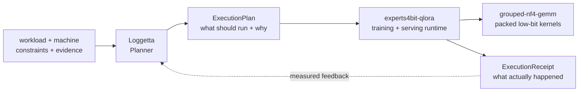

# Jordan Anderson

### ML systems · low-bit MoE · constrained-GPU runtime engineering

**Planner → runtime → kernels, with receipts all the way down.**

  
  
  

  <a href="https://cerinamroth.com">Research notes</a> ·
  <a href="https://jordananderson.work">Work</a> ·
  <a href="https://cerinamroth.com/policy/">Security policy</a>

---

I build the missing layer between **“this should fit”** and **“here is the receipt proving what actually happened.”**

My current work is a three-layer systems stack for running and fine-tuning large Mixture-of-Experts models on hardware far smaller than the model:

> **120B MoE QLoRA at 9.82 GB peak VRAM, with 144/144 frozen expert hashes byte-identical after training.**

## The stack

| Layer | Project | Job |
| :--- | :--- | :--- |
| **Planner** | [`loggetta`](https://github.com/pjordanandrsn/loggetta) | Turn a workload, machine, constraints, and evidence into an inspectable `ExecutionPlan`; refuse impossible plans before loading weights; feed `ExecutionReceipt`s back into future planning. |
| **Runtime** | [`experts4bit-qlora`](https://github.com/pjordanandrsn/experts4bit-qlora) | Load, train, serve, offload, and adapt fused MoE experts using the configuration selected by the planner. |
| **Kernels** | [`grouped-nf4-gemm`](https://github.com/pjordanandrsn/grouped-nf4-gemm) | Execute grouped expert compute directly on packed low-bit weights and provide the low-level residency primitives below the runtime. |

### `loggetta`

**Planner + `ExecutionPlan` + `ExecutionReceipt`.**

- Same inputs → deterministic, serializable plan.
- Records the winning setup, rejected alternatives, refusal reasons, warnings, budget sources, and evidence quality.
- Delegates execution to the backend rather than absorbing runtime logic.
- On RTX 5090 / Qwen3-30B-A3B, receipt-calibrated process peak: **24.54 GiB planned vs 24.34 GiB measured**.

> **Loggetta decides what should execute. The backend knows how to execute it.**

### `experts4bit-qlora`

**Training and serving runtime for fused MoE experts.**

- Quantizes fused expert stacks that bitsandbytes’ normal walker silently skips ([bitsandbytes#1849](https://github.com/bitsandbytes-foundation/bitsandbytes/issues/1849)).
- Streaming loader, per-expert LoRA, layer-granular expert offload, training engines, and serving residency.
- **Qwen3-30B-A3B QLoRA: 7.16 GB peak VRAM.**
- **Gemma-4-26B-A4B QLoRA: 8.47 GB peak VRAM.**
- Seed-matched A/B: **57% lower peak VRAM with convergence preserved**, at about +11% seconds/step.

### `grouped-nf4-gemm`

**Packed low-bit compute without the dequantize-to-bf16 round trip.**

- Grouped expert GEMM operates directly on packed weights; codebook decode happens in registers.
- **Qwen3-235B-A22B: 4.3–4.4 tok/s at 15.2 GB VRAM**, with expert streaming at 93–94% of the measured PCIe ceiling.
- Identical-pipeline comparison vs bitsandbytes dequantization: **2.33× throughput, 2.21× energy efficiency**.
- NVMe extends the residency pyramid from VRAM → host RAM → disk with deterministic, provenance-preserving arena bakes.
- MI300X correctness: **44/44** at the same fidelity tier.

## Receipts-driven engineering

I treat measurement infrastructure as part of the system, not garnish added after the benchmark.

| Principle | Practice |
| :--- | :--- |
| **Scope every claim** | Box, driver, software stack, workload, and exact code revision travel with the result. |
| **Pre-register hard comparisons** | Important protocols are [OpenTimestamps-stamped](https://cerinamroth.com/ml/grouped-nf4-gemm/) before the result is known. |
| **Publish refutations** | Failed confirmatories stay public rather than disappearing into the floorboards. |
| **Check invariants** | Frozen expert bytes are hash-checked before and after training. |
| **Label uncertainty** | Measured, derived, inferred, and heuristic quantities remain distinct. |

The method is documented here: [**Receipts-driven engineering**](https://cerinamroth.com/ml/grouped-nf4-gemm/).

## Upstream

### MoE ecosystem

- [`bitsandbytes#1965`](https://github.com/bitsandbytes-foundation/bitsandbytes/pull/1965) · `Experts4bit` for fused 4-bit MoE experts
- [`axolotl#3797`](https://github.com/axolotl-ai-cloud/axolotl/pull/3797) · `expert_offload` integration
- [`unsloth-zoo#915`](https://github.com/unslothai/unsloth-zoo/pull/915) · OLMoE `load_in_4bit` fused-expert routing fix
- [`unsloth-zoo#849`](https://github.com/unslothai/unsloth-zoo/issues/849) · silent expert-weight transposition, reproduced and fixed upstream

### Intel GPU / OpenVINO

Kernel-compile fixes across LoRA, MoE, and fully-connected paths plus regression coverage:
[`#35661`](https://github.com/openvinotoolkit/openvino/pull/35661),
[`#35712`](https://github.com/openvinotoolkit/openvino/pull/35712), and
[`#36017`](https://github.com/openvinotoolkit/openvino/pull/36017) are merged.
[`#36543`](https://github.com/openvinotoolkit/openvino/pull/36543) extends the core input-validation cleanup.

[`ov-impact-bench`](https://github.com/pjordanandrsn/ov-impact-bench) measures the actual GPU-vs-CPU-fallback impact on Intel hardware.

## Elsewhere

Security research on the side, with good-faith testing and coordinated disclosure.

[**cerinamroth.com**](https://cerinamroth.com) · [**jordananderson.work**](https://jordananderson.work)

